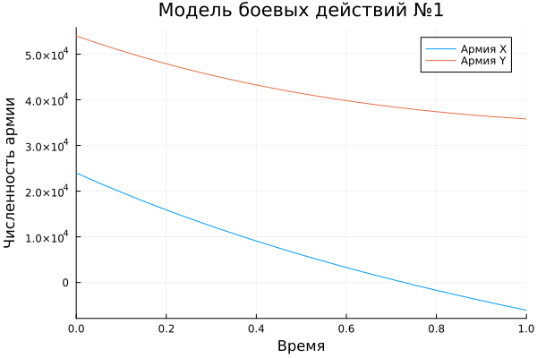
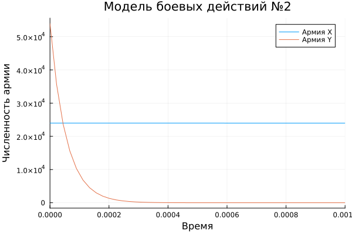
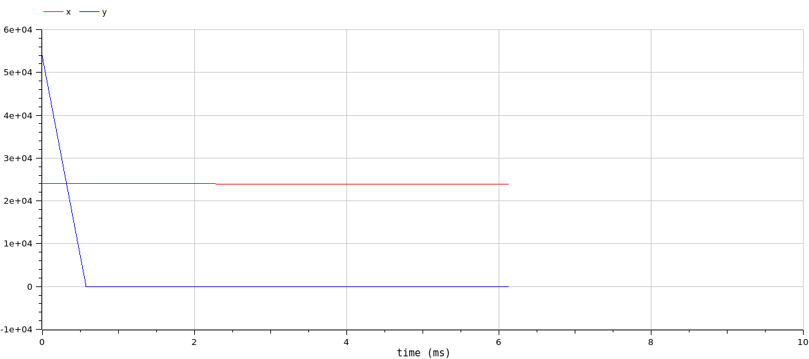

---
## Front matter
title: "Лабораторная работа №3"
subtitle: "Модель боевых действий"
author: "Демидова Екатерина Алексеевна"

## Generic otions
lang: ru-RU
toc-title: "Содержание"

## Bibliography
bibliography: bib/cite.bib
csl: pandoc/csl/gost-r-7-0-5-2008-numeric.csl

## Pdf output format
toc: true # Table of contents
toc-depth: 2
lof: true # List of figures
lot: false # List of tables
fontsize: 12pt
linestretch: 1.5
papersize: a4
documentclass: scrreprt
## I18n polyglossia
polyglossia-lang:
  name: russian
  options:
	- spelling=modern
	- babelshorthands=true
polyglossia-otherlangs:
  name: english
## I18n babel
babel-lang: russian
babel-otherlangs: english
## Fonts
mainfont: PT Serif
romanfont: PT Serif
sansfont: PT Sans
monofont: PT Mono
mainfontoptions: Ligatures=TeX
romanfontoptions: Ligatures=TeX
sansfontoptions: Ligatures=TeX,Scale=MatchLowercase
monofontoptions: Scale=MatchLowercase,Scale=0.9
## Biblatex
biblatex: true
biblio-style: "gost-numeric"
biblatexoptions:
  - parentracker=true
  - backend=biber
  - hyperref=auto
  - language=auto
  - autolang=other*
  - citestyle=gost-numeric
## Pandoc-crossref LaTeX customization
figureTitle: "Рис."
tableTitle: "Таблица"
listingTitle: "Листинг"
lofTitle: "Список иллюстраций"
lotTitle: "Список таблиц"
lolTitle: "Листинги"
## Misc options
indent: true
header-includes:
  - \usepackage{indentfirst}
  - \usepackage{float} # keep figures where there are in the text
  - \floatplacement{figure}{H} # keep figures where there are in the text
---

# Цель работы

Построить математическую модель боевых действий и провести анализ.

# Задание

Между страной $X$ и страной $Y$ идет война. Численность состава войск исчисляется от начала войны, и являются временными функциями $x(t)$ и $y(t)$. В начальный момент времени страна $X$ имеет армию численностью 24 000 человек, а в распоряжении страны $Y$ армия численностью в 54 000 человек. Для упрощения модели считаем, что коэффициенты $a$, $b$, $c$, $h$ постоянны. Также считаем $P(t)$ и $Q(t)$ непрерывные функции.

Построить графики изменения численности войск армии $X$ и армии $Y$ для следующих случаев:

1. Модель боевых действий между регулярными войсками
2. Модель ведение боевых действий с участием регулярных войск и партизанских отрядов 

# Теоретическое введение

Под боевыми действиями понимаются организованные действия частей, соединений, объединений при выполнении поставленных боевых (оперативных) задач. Боевые действия сухопутных войск ведутся в форме общевойсковых боев подразделений (частей и соединений), операций и сражений армий (фронтов)[@mathnet:bash].

Моделирование боевых действий началось во время Первой мировой войны. В годы Второй мировой войны возник научный метод «исследование операций», дающий в распоряжение военного командования или другого исполнительного органа количественные основания для принятия решений по действию войск или других организаций, находящихся под их управлением. Большой вклад в развитие моделей боя внесен специалистами Вычислительного центра им. А. А. Дородницына. В частности, П. С. Краснощеков и А. А. Петров описали динамику боя в пространстве, представив модель перемещения линии фронта. Ю. Н. Павловским предложен способ учета морального фактора в уравнении равенства сил квадратичной модели боя[@kim:bash]. 

Уравнения Осипова – Ланчестера можно записать в виде[@mathnet:bash]:

$$
\begin{cases}
 \dfrac{dx}{dt} = -a_{y}*y^p*x^q \\
 \dfrac{dy}{dt} = -a_{x}*x^p*y^q
\end{cases}
$$

где $x(y)$ – численности войск первой (второй) стороны в момент времени $t$; $a_x$ ($a_y$) – эффективность огня первой (второй) стороны (число поражаемых целей противника в единицу времени)1; p и q – параметры степени.
В начальный момент времени заданы численности сторон: $x(0) = x_0$ и $y(0) = y_0$.

Выделяются следующие разновидности модели Осипова – Ланчестера. Если p = q = 1 (в общем случае, p – q = 0), то это линейная модель боя с условием равенства сил. Если p = 1, q = 0 (в общем случае, p – q = 1), то это квадратичная модель боя с условием равенства сил. Наконец, если p = 0, q = 1 (в общем случае, q – p = 1), то это логарифмическая модель боя.

# Выполнение лабораторной работы

## Модель боевых действий между регулярными войсками

Модель боевых действий между регулярными войсками. Зададим коэффициент смертности, не связанный с боевыми действиями у первой армии 0,4, у второй 0,64. Коэффициенты эффективности первой и второй армии 0,77 и 0,3 соответственно. Функция, описывающая подход подкрепление первой армии, $P(t) = \sin{2t}+2$, подкрепление второй армии описывается функцией $Q(t) = \cos{t} + 1$. Тогда получим следующую систему, описывающую противостояние между регулярными войсками X и Y:

$$
\begin{cases}
\dfrac{dx}{dt} = -0,4 x(t)- 0,64y(t) + \sin{2t}+2\\
\dfrac{dy}{dt} = -0,77 x(t)- 0,3 y(t) + \cos{t} + 1
\end{cases}
$$

Зададим начальные условия:

$$
\begin{cases}
x_0 = 24000 \\
y_0 = 54000
\end{cases}
$$

В Julia начальные условия задаются следующим образом:

```julia
x0 = 24000
y0 = 54000
p1 = [0.4, 0.64, 0.77, 0.3]
tspan = (0,1)
```

Затем запишем систему ОДУ через функцию, зададим соответсвующую задачу Коши с помощью ODEProblem и решим её с помощью solve:

```julia
function f1(u,p,t)
	x,y = u
	a,b,c,h = p
	dx = -a*x-b*y + sin(2*t)+2
	dy = -c*x-h*y + cos(t) +1
	return [dx, dy]
end

prob1 = ODEProblem(f1,[x0,y0], tspan,p)

solution1 = solve(prob1, Tsit5())
```

И с помощью библиотеки Plots построим график изменения численности войск армии $X$ и армии $Y$:

```julia
plot(solution1, title = "Модель боевых действий №1", 
  label = ["Армия X" "Армия Y"], xaxis = "Время", yaxis = "Численность армии")
```
В результате можно увидеть, что при таких параметрах модели армия X побеждает армию Y(рис. @fig:001):

{#fig:001 width=70%}

Построим такую же модель с помощью OpenModelica. Модель задается слеудующим образом:

```
model lab3

Real x(start=24000);
Real y(start=54000);
Real p;
Real q;

parameter Real a=0.4;
parameter Real b=0.64;
parameter Real c=0.77;
parameter Real h=0.3;

equation
  der(x) = -a*x-b*y + p;
  der(y) = -c*x-h*y + q;
  p = sin(2*time)+2;
  q = cos(time)+1;

end lab3;
```

Промежуток времени и численный метод решения задаётся в настройках симуляции. Просимулировав модель получим график, совпадающий с предыдущим(рис. @fig:002):

{#fig:002 width=70%}

Разница реализаций визуально не заметна.

## Модель боевых действий с участием регулярных войск и партизанских отрядов

Модель боевых действий с участием регулярных войск и партизанских отрядов. Зададим коэффициент смертности, не связанный с боевыми действиями у первой армии 0,35, у второй 0,67. Коэффициенты эффективности первой и второй армии 0,77 и 0,45 соответственно. Функция, описывающая подход подкрепление первой армии, $P(t) = \sin{2t}+2$, подкрепление второй армии описывается функцией $Q(t) = \cos{t} + 1$. Тогда получим следующую систему, описывающую противостояние между регулярными войсками X и Y:

$$
\begin{cases}
\dfrac{dx}{dt} = -0,35 x(t)- 0,67 y(t) + \sin{2t}+2 \\
\dfrac{dy}{dt} = -0,77 x(t)- 0,45 y(t) + \cos{t} + 1
\end{cases}
$$

В Julia начальные условия задаются следующим образом:

```julia
x0 = 24000
y0 = 54000
p2 = [0.35, 0.67, 0.77, 0.45]
tspan = (0,1)
```

Затем запишем систему ОДУ через функцию, зададим соответсвующую задачу Коши с помощью ODEProblem и решим её с помощью solve:

```julia
function f2(u,p,t)
	x,y = u
	a,b,c,h = p
	dx = -a*x-b*y + sin(2*t)+2
	dy = -c*x*y-h*y + cos(t) +1
	return [dx, dy]
end

prob2 = ODEProblem(f2,[x_0,y_0], tspan,p2)
solution2 = solve(prob2, Tsit5())
```
И с помощью библиотеки Plots построим график изменения численности войск армии $X$ и армии $Y$:

```julia
plot(solution2, title = "Модель боевых действий №2", 
  label = ["Армия X" "Армия Y"], xaxis = "Время", yaxis = "Численность армии")
```
В результате можно увидеть, что при таких параметрах модели армия Y побеждает армию X (рис. @fig:002):

{#fig:003 width=70%}

На графике плохо видно убывание армии X, так как это происходит очень быстро, поэтому приблизим меньший промежуток(рис. @fig:003).

```julia
plot(solution2, title = "Модель боевых действий №2", 
  label = ["Армия X" "Армия Y"], xaxis = "Время", yaxis = "Численность армии", 
  xlimit = [0,0.001])
```

{#fig:004 width=70%}


Построим такую же модель с помощью OpenModelica. Модель задается слеудующим образом:
```
model lab3

Real x(start=24000);
Real y(start=54000);
Real p;
Real q;

parameter Real a=0.35;
parameter Real b=0.67;
parameter Real c=0.77;
parameter Real h=0.45;

equation
  der(x) = -a*x-b*y + p;
  der(y) = -c*x*y-h*y + q;
  p = sin(2*time)+2;
  q = cos(time)+1;

end lab3;
```

Промежуток времени и численный метод решения задаётся в настройках симуляции. Просимулировав модель также построим два графика(рис. @fig:005, @fig:006):

{#fig:005 width=70%}

{#fig:006 width=70%}

Можно увидеть, что график(рис. @fig:006), построенный в OpenModelica отличается от (рис. @fig:004), численность армии X убывает резко до нуля, а в Julia более плавно, так как в ней точность вычислений выше. А при большем расстоянии разница численности армии X не заметна(так как уходит в ноль), но в Julia график численности армии Y перестает меняться после вымирания соперника, а в OpenModelica продолжает убывать.

# Выводы

Построили математическую модель боевых действий и провели анализ.

# Список литературы{.unnumbered}

::: {#refs}
:::
