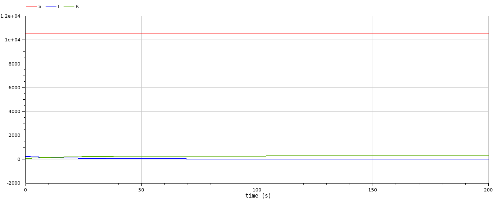
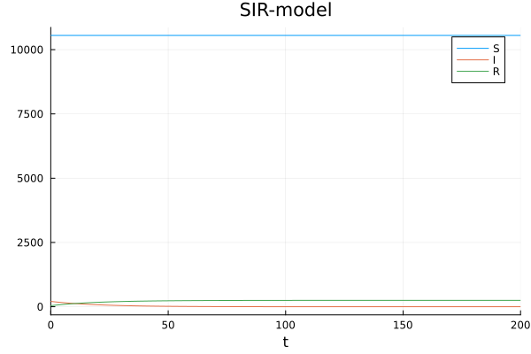
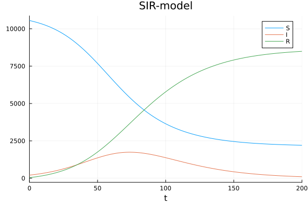

---
## Front matter
lang: ru-RU
title: Лабораторная работа 6
subtitle: Задача об эпидемии
author:
  - Демидова Е. А.
institute:
  - Российский университет дружбы народов, Москва, Россия
date: 12 марта 2024

## i18n babel
babel-lang: russian
babel-otherlangs: english

## Formatting pdf
toc: false
toc-title: Содержание
slide_level: 2
aspectratio: 169
section-titles: true
theme: metropolis
header-includes:
 - \metroset{progressbar=frametitle,sectionpage=progressbar,numbering=fraction}
 - '\makeatletter'
 - '\beamer@ignorenonframefalse'
 - '\makeatother'
---

# Информация

## Докладчик

:::::::::::::: {.columns align=center}
::: {.column width="70%"}

  * Демидова Екатерина Алексеевна
  * студентка группы НКНбд-01-21
  * Российский университет дружбы народов
  * <https://github.com/eademidova>

:::
::: {.column width="30%"}


:::
::::::::::::::

# Вводная часть

## Цели 

Исследовать простейшую математическую модель эпидемии(SIR).

## Задачи

На одном острове вспыхнула эпидемия. Известно, что из всех проживающих на острове ($N=10 800$) в момент начала эпидемии (t=0) число заболевших людей (являющихся распространителями инфекции) $I(0)=208$, А число здоровых людей с иммунитетом к болезни $R(0)=41$. Таким образом, число людей восприимчивых к болезни, но пока здоровых, в начальный момент времени $S(0)=N-I(0)- R(0)$. Постройте графики изменения числа особей в каждой из трех групп. Рассмотрите, как будет протекать эпидемия в случае:

1) если $I(0)<I^*$
2) если $I(0)>I^*$

## Материалы и методы

- Язык программирования `Julia` 
- Библиотеки
	- `OrdinaryDiffEq`
	- `Plots`
- Язык программирования `OpenModelica` 

# Выполнение лабораторной работы

## Теоретическое введение

$$
\begin{cases}
\frac{dS}{dt} = - \frac{\beta I S}{N}, \\
\frac{dI}{dt} = \frac{\beta I S}{N} - \gamma I, \\
\frac{dR}{dt} = \gamma I,
\end{cases}
$$

где $S$ -- численность восприимчивой популяции, $I$ -- численность инфицированных, $R$ -- численность удаленной популяции (в результате смерти или выздоровления), и $N$ — это сумма этих трёх, а $\beta$ и $\gamma$ - это коэффициенты заболеваемости
и выздоровления соответственное

##  Julia. Программная реализация модели хищник-жертва

```julia
//Начальные условия и параметры

R = 41
I = 208
N = 10800
S = N-R-I
p = [0.1, 0.05]
u0 = [S,I,R]
tspan=(0.0,200.0)
```

## Julia. Программная реализация модели хищник-жертва

```julia
//При I(0)>I*

function sir!(du,u,p,t)
    b,g = p
	  S, I, R = u
	  N = S+I+R
    du[1] = -b*u[2]*u[1]/N
    du[2] = b*u[2]*u[1]/N - g*u[2]
    du[3] = g*u[2]
end
```

## Julia. Программная реализация модели хищник-жертва

```julia
//При I(0)<I*

function sir_0!(du,u,p,t)
    b,g = p
    du[1] = 0
    du[2] = - g*u[2]
    du[3] = g*u[2]
end
```

## Julia. Программная реализация модели хищник-жертва

```julia
problem = ODEProblem(sir!,u0,tspan,p)
solution = solve(problem, Tsit5())

problem = ODEProblem(sir_0!,u0,tspan,p)
solution = solve(problem, Tsit5())
```

## OpenModelica. Программная реализация модели хищник-жертва

```
parameter Real N = 10800;
parameter Real b = 0.1;
parameter Real g = 0.05;

Real S(start = N - 208 - 41);
Real I(start = 208);
Real R(start = 41);
```

## OpenModelica. Программная реализация модели хищник-жертва

Модель случая $I(0)>I^*$:

```
equation

der(S) = -b*S*I/N;
der(I) = b*S*I/N - g*I;
der(R) = g*I;
```

Модель случая $I(0)<I^*$:

```
equation

der(S) = -b*S*I/N;
der(I) = b*S*I/N - g*I;
der(R) = g*I;
```

## Графики

{#fig:001 width=70%}

## Графики

{#fig:002 width=70%}

## Графики

{#fig:003 width=70%}

## Графики

{#fig:004 width=70%}

# Выводы

Построили математическую модель эпидемии.

# Список литературы

1. Compartmental models in epidemiology [Электронный ресурс]. Wikimedia Foundation, Inc., 2024. URL: https://en.wikipedia.org/wiki/Compartmental_mo dels_in_epidemiology.
2. Жумартова Б.О., Ысмагул Р.С. ПРИМЕНЕНИЕ SIR МОДЕЛИ В МОДЕЛИРОВАНИИ ЭПИДЕМИЙ. Международный журнал гуманитарных и естественных наук, 2021. 258 с.