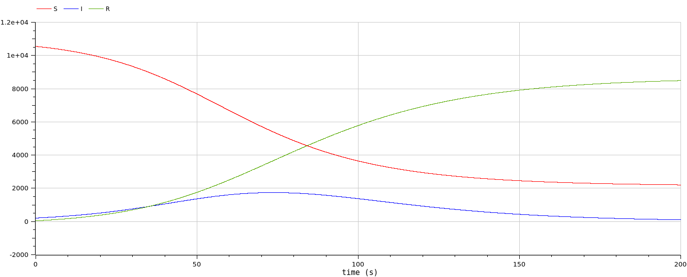

---
## Front matter
title: "Лабораторная работа №6"
subtitle: "Задача об эпидемии"
author: "Демидова Екатерина Алексеевна"

## Generic otions
lang: ru-RU
toc-title: "Содержание"

## Bibliography
bibliography: bib/cite.bib
csl: pandoc/csl/gost-r-7-0-5-2008-numeric.csl

## Pdf output format
toc: true # Table of contents
toc-depth: 2
lof: true # List of figures
lot: false # List of tables
fontsize: 12pt
linestretch: 1.5
papersize: a4
documentclass: scrreprt
## I18n polyglossia
polyglossia-lang:
  name: russian
  options:
	- spelling=modern
	- babelshorthands=true
polyglossia-otherlangs:
  name: english
## I18n babel
babel-lang: russian
babel-otherlangs: english
## Fonts
mainfont: PT Serif
romanfont: PT Serif
sansfont: PT Sans
monofont: PT Mono
mainfontoptions: Ligatures=TeX
romanfontoptions: Ligatures=TeX
sansfontoptions: Ligatures=TeX,Scale=MatchLowercase
monofontoptions: Scale=MatchLowercase,Scale=0.9
## Biblatex
biblatex: true
biblio-style: "gost-numeric"
biblatexoptions:
  - parentracker=true
  - backend=biber
  - hyperref=auto
  - language=auto
  - autolang=other*
  - citestyle=gost-numeric
## Pandoc-crossref LaTeX customization
figureTitle: "Рис."
tableTitle: "Таблица"
listingTitle: "Листинг"
lofTitle: "Список иллюстраций"
lotTitle: "Список таблиц"
lolTitle: "Листинги"
## Misc options
indent: true
header-includes:
  - \usepackage{indentfirst}
  - \usepackage{float} # keep figures where there are in the text
  - \floatplacement{figure}{H} # keep figures where there are in the text
---

# Цель работы

Исследовать простейшую математическую модель эпидемии(SIR).

# Задание

**Вариант 22**

На одном острове вспыхнула эпидемия. Известно, что из всех проживающих на острове ($N=10 800$) в момент начала эпидемии (t=0) число заболевших людей (являющихся распространителями инфекции) $I(0)=208$, А число здоровых людей с иммунитетом к болезни $R(0)=41$. Таким образом, число людей восприимчивых к болезни, но пока здоровых, в начальный момент времени $S(0)=N-I(0)- R(0)$. Постройте графики изменения числа особей в каждой из трех групп. Рассмотрите, как будет протекать эпидемия в случае:

1) если $I(0)<I^*$
2) если $I(0)>I^*$

# Теоретическое введение

Компартментные модели — это очень общий метод моделирования. Их часто применяют для математического моделирования инфекционных заболеваний. Популяция распределяется по отсекам с метками, например S, I или R (восприимчивый, инфекционный или выздоровевший). Люди могут перемещаться между отсеками.  [@wiki:bash].

Модель SIR — одна из самых простых секционных моделей, и многие модели являются производными от этой базовой формы. Модель состоит из трех отделений:

S: Число восприимчивых людей. Когда восприимчивый и заразный человек вступают в «инфекционный контакт», восприимчивый человек заражается болезнью и переходит в инфекционный отсек.
I: Число заразных. Это лица, которые были инфицированы и способны заразить восприимчивых лиц.
R: количество удаленных (и неуязвимых) или умерших особей. Это лица, которые были инфицированы и либо выздоровели от болезни и попали в удаленный отсек, либо умерли. Предполагается, что число смертей незначительно по отношению к общей численности населения. Этот отсек также можно назвать «восстановленным» или «устойчивым».

До того, как число заболевших не превышает критического значения $I^*$, считаем, что все больные изолированы и не заражают здоровых. Когда $I(t) > I^*$, тогда инфицирование способны заражать восприимчивых к болезни особей.

Система SIR без динамики жизнедеятельности (рождения и смерти, иногда называемой демографией) может быть выражена следующей системой обыкновенных дифференциальных уравнений[@zhum]: 

$$
\begin{cases}
\frac{dS}{dt} = - \frac{\beta I S}{N}, \\
\frac{dI}{dt} = \frac{\beta I S}{N} - \gamma I, \\
\frac{dR}{dt} = \gamma I,
\end{cases}
$$

где $S$ -- численность восприимчивой популяции, $I$ -- численность инфицированных, $R$ -- численность удаленной популяции (в результате смерти или выздоровления), и $N$ — это сумма этих трёх, а $\beta$ и $\gamma$ - это коэффициенты заболеваемости
и выздоровления соответственно

# Выполнение лабораторной работы

## Программная реализация модели эпидемии

Зададим функцию для решения модели эпидемии. Возьмем интервал $t \in [0; 200]$ с начальными условиями $N=10 800$, \, I(0)=208$, \,R(0)=41 , \, S(0)=N-I(0)- R(0) . Зададим функции для случаев если $I(0)<I^*$ и если $I(0)>I^*$. Рассмотрим сначала реализацию в Julia. Зададим начальные условия и функции для двух случаев:


```julia

//Начальные условия и параметры

R = 41
I = 208
N = 10800
S = N-R-I
p = [0.1, 0.05]
u0 = [S,I,R]
tspan=(0.0,200.0)

//При I(0)>I*

function sir!(du,u,p,t)
    b,g = p
	  S, I, R = u
	  N = S+I+R
    du[1] = -b*u[2]*u[1]/N
    du[2] = b*u[2]*u[1]/N - g*u[2]
    du[3] = g*u[2]
end

//При I(0)<I*

function sir_0!(du,u,p,t)
    b,g = p
    du[1] = 0
    du[2] = - g*u[2]
    du[3] = g*u[2]
end
```

Для задания проблемы используется функция `ODEProblem`, а для решения -- численный метод Tsit5():

```julia
problem = ODEProblem(sir!,u0,tspan,p)
solution = solve(problem, Tsit5())

problem = ODEProblem(sir_0!,u0,tspan,p)
solution = solve(problem, Tsit5())
```

Также зададим эту модель в OpenModelica. Модель для $I(0)>I^*$:

```
model lab6

parameter Real N = 10800;
parameter Real b = 0.1;
parameter Real g = 0.05;

Real S(start = N - 208 - 41);
Real I(start = 208);
Real R(start = 41);

equation

der(S) = -b*S*I/N;
der(I) = b*S*I/N - g*I;
der(R) = g*I;

end lab6;
```

Модель случая $I(0)<I^*$:

```
model lab6

parameter Real N = 10800;
parameter Real b = 0.1;
parameter Real g = 0.05;

Real S(start = N - 208 - 41);
Real I(start = 208);
Real R(start = 41);

equation

der(S) = -b*S*I/N;
der(I) = b*S*I/N - g*I;
der(R) = g*I;

end lab6;
```

## Посмтроение графиков решений и их анализ

Посмотрим график изменения числа особей в каждой из трех групп при $I(0)<I^*$(рис. @fig:001,  @fig:002):

{#fig:001 width=70%}

{#fig:002 width=70%}

Графики решений, полученные с помощью OpenModelica и Julia идентичны. Можно увидеть, что число здоровых не изменяется, так как в этом случае все заражённые изолированы. При это заражённые выздоравливают и приобретают иммунитет.

Посмотрим график изменения числа особей в каждой из трех групп при $I(0)<I^*$(рис. @fig:003,  @fig:004):

{#fig:003 width=70%}

{#fig:004 width=70%}

Графики решений, полученные с помощью OpenModelica и Julia также идентичны. Можно увидеть, что сначала количество зараженных увеличивает, как и количество приобретающих иммунитет, при этом уменьшается количество здоровых без иммунитета. Затем количество зараженных начинает уменьшаться, а другие две категории изменяются так же, как раньше, но медленнее. 

# Выводы

Построили математическую модель эпидемии.

# Список литературы{.unnumbered}

::: {#refs}
:::
