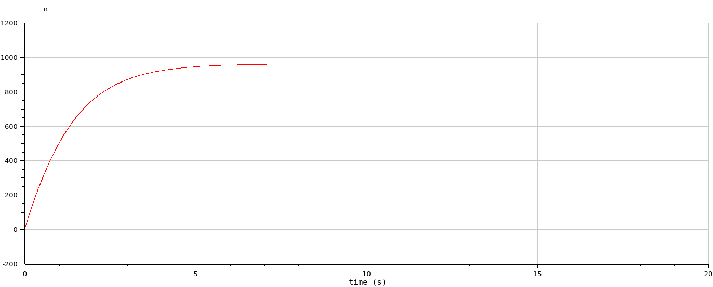
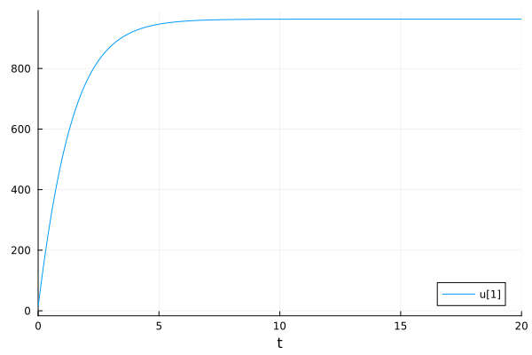
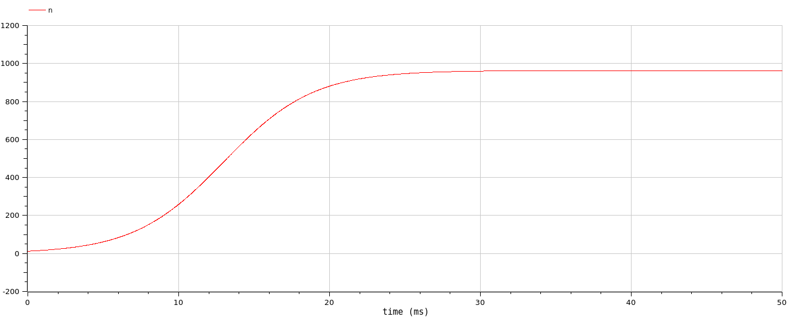
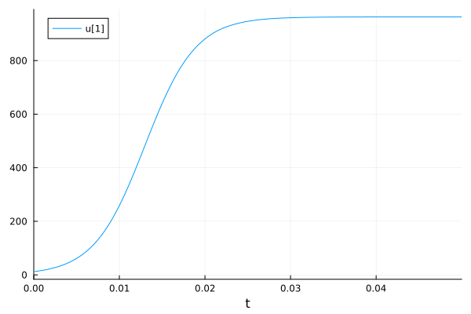
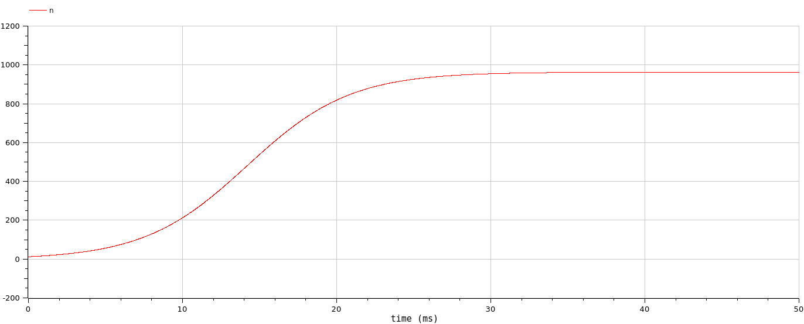
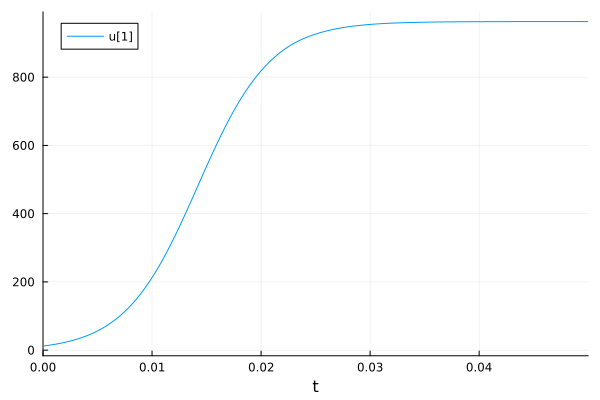

---
## Front matter
lang: ru-RU
title: Лабораторная работа 7
subtitle: Эффективность рекламы
author:
  - Демидова Е. А.
institute:
  - Российский университет дружбы народов, Москва, Россия
date: 12 марта 2024

## i18n babel
babel-lang: russian
babel-otherlangs: english

## Formatting pdf
toc: false
toc-title: Содержание
slide_level: 2
aspectratio: 169
section-titles: true
theme: metropolis
header-includes:
 - \metroset{progressbar=frametitle,sectionpage=progressbar,numbering=fraction}
 - '\makeatletter'
 - '\beamer@ignorenonframefalse'
 - '\makeatother'
---

# Информация

## Докладчик

:::::::::::::: {.columns align=center}
::: {.column width="70%"}

  * Демидова Екатерина Алексеевна
  * студентка группы НКНбд-01-21
  * Российский университет дружбы народов
  * <https://github.com/eademidova>

:::
::: {.column width="30%"}


:::
::::::::::::::

# Вводная часть

## Цели 

Исследовать простейшую математическую модель эффективности рекламы.

## Задачи

Постройте график распространения рекламы, математическая модель которой описывается следующим уравнением:

1. $\frac{dn}{dt} = (0.68 + 0.68 (t)n(t))(N-n(t))$
2. $\frac{dn}{dt} = (0.00001 + 0.35 (t)n(t))(N-n(t))$
3. $\frac{dn}{dt} = (0.51 sin(5t) + 0.31 cos(3t)n(t))(N-n(t))$

При этом объем аудитории $N = 963$, в начальный момент о товаре знает $12$ человек. Для случая 2 определите в какой момент времени скорость распространения рекламы будет иметь максимальное значение.

## Материалы и методы

- Язык программирования `Julia` 
- Библиотеки
	- `OrdinaryDiffEq`
	- `Plots`
- Язык программирования `OpenModelica` 

# Выполнение лабораторной работы

## Теоретическое введение

$$
\frac{dn}{dt} = (\alpha _1 + \alpha _2 (t)n(t))(N-n(t))
$$

$\dfrac{dn}{dt}$ - скорость изменения со временем числа потребителей, узнавших о товаре и готовых его купить,$t$ - время, $\alpha _1 (t)$ - характеризует интенсивность рекламной кампании, $\alpha _2 (t)$ - характеризует интенсивность сарафанного радио.

##  Julia. Программная реализация модели

```julia

//Начальные условия и параметры

n0 = 12
p1 = [0.68, 0.00018, 963]
p2 = [0.00001, 0.35, 963]
p3 = [0.51, 0.31, 963]
tspan1 = (0,20)
tspan2 = (0,0.05)

// Модель

f(n, p, t) = (p[1] + p[2]*n)*(p[3]-n) 

f3(n, p, t) = (p[1]*sin(5*t) + p[2]*cos(5*t)*n)*(p[3]-n) 
```

## Julia. Программная реализация модели

```julia
prob1 = ODEProblem(f, n0, tspan1, p1)
prob2 = ODEProblem(f, n0, tspan1, p2)
prob3 = ODEProblem(f3, n0, tspan2, p3)

sol1 = solve(prob1, Tsit5())
sol2 = solve(prob2, Tsit5())
sol3 = solve(prob3, Tsit5())
```

## OpenModelica. Программная реализация модели

```
model lab7

Real n(start=12);

parameter Real a1=0.68;
parameter Real a2=0.00018;
parameter Real N=963;

equation

der(n) = (a1 - a2*n)*(N - n);

end lab7;
```

## OpenModelica. Программная реализация модели

```
model lab7

Real n(start=12);

parameter Real a1=0.00001;
parameter Real a2=0.35;
parameter Real N=963;

equation

der(n) = (a1 - a2*n)*(N - n);

end lab7;
```

## OpenModelica. Программная реализация модели

```
model lab7

Real n(start=12);

parameter Real a1=0.51;
parameter Real a2=0.31;
parameter Real N=963;

equation

der(n) = (a1*p + a2*q*n)*(N - n);

p = sin(5*time);
q = cos(5*time);

end lab7;
```

## Графики

{#fig:001 width=70%}

## Графики

{#fig:002 width=70%}

## Графики

Во втором случае скорость распространения рекламы будет иметь максимальное значение 80456.8959 в момент времени 0.013.

{#fig:003 width=65%}

## Графики

{#fig:004 width=70%}

## Графики

{#fig:003 width=70%}

## Графики

{#fig:004 width=70%}

# Выводы

Построили математическую модель эффективности рекламы.

# Список литературы

1. Самарский А.А., Михайлов А.П. Математическое моделировамоделирование: Идеи. Методы. Примеры. М.: Физматлит, 2001. 320 с.