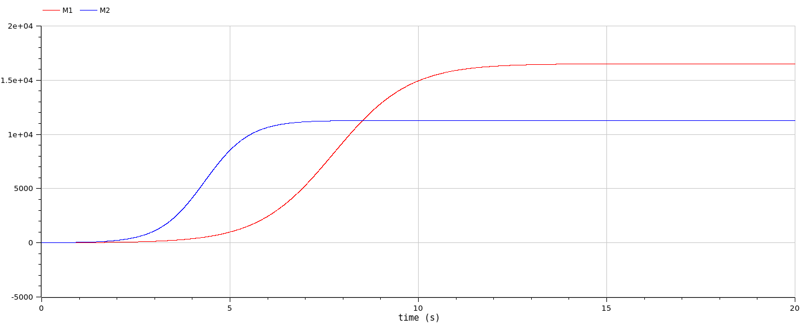
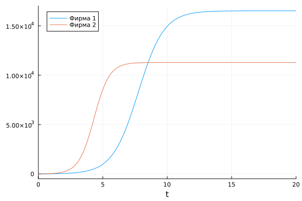
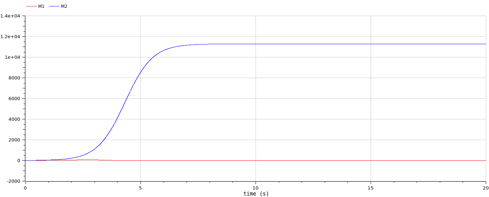
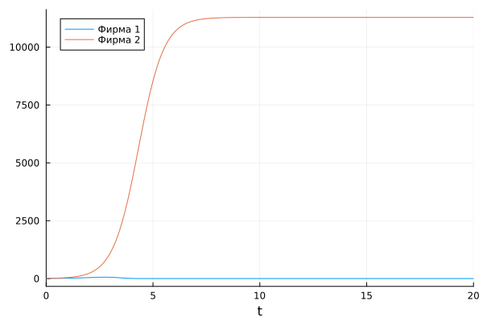
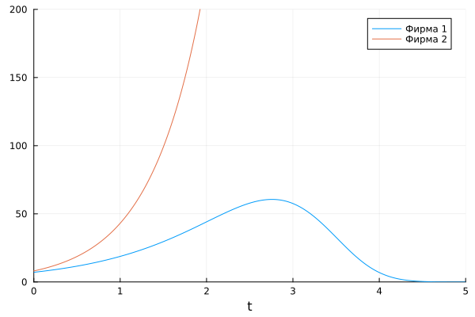

---
## Front matter
lang: ru-RU
title: Лабораторная работа №8
subtitle: Модель конкуренции двух фирм
author:
  - Демидова Е. А.
institute:
  - Российский университет дружбы народов, Москва, Россия
date: 26 марта 2024

## i18n babel
babel-lang: russian
babel-otherlangs: english

## Formatting pdf
toc: false
toc-title: Содержание
slide_level: 2
aspectratio: 169
section-titles: true
theme: metropolis
header-includes:
 - \metroset{progressbar=frametitle,sectionpage=progressbar,numbering=fraction}
 - '\makeatletter'
 - '\beamer@ignorenonframefalse'
 - '\makeatother'
---

# Информация

## Докладчик

:::::::::::::: {.columns align=center}
::: {.column width="70%"}

  * Демидова Екатерина Алексеевна
  * студентка группы НКНбд-01-21
  * Российский университет дружбы народов
  * <https://github.com/eademidova>

:::
::: {.column width="30%"}


:::
::::::::::::::

# Вводная часть

## Цели 

Исследовать простейшую математическую модель конкуренции двух фирм.

## Формулировка задачи

**Случай 1.**
$$\begin{cases}
\frac{d M_1}{d \theta} = M_1 - \dfrac{b}{c_1} M_1 M_2 - \dfrac{a_1}{c_1} M_1^2,\\
\frac{d M_2}{d \theta} = \dfrac{c_2}{c_1} M_1 - \dfrac{b}{c_1} M_1 M_2 - \dfrac{a_2}{c_1} M_2^2,
\end{cases}$$

**Случай 2.**
$$\begin{cases}
\frac{d M_1}{d \theta} = M_1 - (\dfrac{b}{c_1} + 0.0013) M_1 M_2 - \dfrac{a_1}{c_1} M_1^2,\\
\frac{d M_2}{d \theta} = \dfrac{c_2}{c_1} M_1 - \dfrac{b}{c_1} M_1 M_2 - \dfrac{a_2}{c_1} M_2^2,
\end{cases}$$

где $a_1 = \dfrac{p_{cr}}{(\tau _1^2 \tilde{p_1} N q)}$, $a_2 = \dfrac{p_{cr}}{(\tau _2 ^2*\tilde{p_2} N q)}$, $b = \dfrac{p_{cr}}{(\tau _1^2 \tau _2^2 \tilde{p_1}^2 \tilde{p_2}^2 N q)}$,
$c_1 = \dfrac{(p_{cr}-p_1)}{(\tau _1 \tilde{p_1})}$, $c_2 = \dfrac{(p_{cr}-p_2)}{(\tau _2 \tilde{p_2})}$.

## Формулировка задачи

Для обоих случаев рассмотри задачу со следующими начальными условиями: $M_0^1 = 7.1$, $M_0^2 = 8.1$.

И параметрами:  $p_{cr} = 44$, $N = 77$, $q = 1$, $\tau_{1} = 26$, $\tau_2 = 21$, $\tilde p_1 = 11$,$\tilde p_1 = 8.7$ 

- $N$ -- число потребителей производимого продукта.
- $\tau$ -- длительность производственного цикла
- $p$ -- рыночная цена товара
- $\tilde p$ -- себестоимость продукта, то есть переменные издержки на производство единицы продукции.
- $q$ -- максимальная потребность одного человека в продукте в единицу времени 
- $\theta = \dfrac{t}{c_1}$ -- безразмерное время

## Формулировка задачи

1. Постройте графики изменения оборотных средств фирмы 1 и фирмы 2 без учета постоянных издержек и с веденной нормировкой для случая 1.
2. Постройте графики изменения оборотных средств фирмы 1 и фирмы 2 без учета постоянных издержек и с веденной нормировкой для случая 2.

## Материалы и методы

- Язык программирования `Julia` 
- Библиотеки
	- `OrdinaryDiffEq`
	- `Plots`
- Язык программирования `OpenModelica` 

# Выполнение лабораторной работы

##  Julia. Программная реализация модели

```julia
//Начальные условия и параметры

p_cr = 44 #критическая стоимость продукта
tau1 = 26 #длительность производственного цикла фирмы 1
p1 = 11 #себестоимость продукта у фирмы 1
tau2 = 21 #длительность производственного цикла фирмы 2
p2 = 8.7 #себестоимость продукта у фирмы 2
N = 77 #число потребителей производимого продукта
q = 1 #максимальная потребность одного человека в продукте в единицу времени
```
##  Julia. Программная реализация модели

```julia
a1 = p_cr/(tau1*tau1*p1*p1*N*q)
a2 = p_cr/(tau2*tau2*p2*p2*N*q)
b = p_cr/(tau1*tau1*tau2*tau2*p1*p1*p2*p2*N*q)
c1 = (p_cr-p1)/(tau1*p1)
c2 = (p_cr-p2)/(tau2*p2)
constant1 = 0
constant2 = 0.0013
p1 = [a1,a2,b,c1,c2,constant1]
p2 = [a1,a2,b,c1,c2,constant2]

tspan = (0,20);
u0=[7.1;8.1]; #начальное значение объема оборотных средств x1 и х2
```

##  Julia. Программная реализация модели

```julia
function syst(du,u,p,t)
	a1, a2, b, c1, c2, constant = p
	du[1] = u[1] - (a1/c1)*u[1]*u[1] - (b/c1+constant)*u[1]*u[2]
	du[2] = (c2/c1)*u[2] - (a2/c1)*u[2]*u[2] - (b/c1)*u[1]*u[2]
end
```

## Julia. Программная реализация модели

```julia
prob1 = ODEProblem(syst, u0, tspan, p1)
solution1 = solve(prob1, Tsit5(), saveat = 0.001)
plot(solution1, labels = ["Фирма 1" "Фирма 2"])

prob2 = ODEProblem(syst, u0, tspan, p2)
solution2 = solve(prob2, Tsit5(), saveat = 0.001)
plot(solution2, labels = ["Фирма 1" "Фирма 2"])
```

## OpenModelica. Программная реализация модели

```
Real M1(start=7.1);
Real M2(start=8.1);

parameter Real p_cr = 44; //критическая стоимость продукта
parameter Real tau1 = 26; //длительность производственного цикла фирмы 1
parameter Real p1 = 11; //себестоимость продукта у фирмы 1
parameter Real tau2 = 21; //длительность производственного цикла фирмы 2
parameter Real p2 = 8.7; //себестоимость продукта у фирмы 2
parameter Real N = 77; //число потребителей производимого продукта
parameter Real q = 1; //максимальная потребность одного человека в продукте в единицу времени
```

## OpenModelica. Программная реализация модели

```
parameter Real a1 = p_cr/(tau1*tau1*p1*p1*N*q);
parameter Real a2 = p_cr/(tau2*tau2*p2*p2*N*q);
parameter Real b = p_cr/(tau1*tau1*tau2*tau2*p1*p1*p2*p2*N*q);
parameter Real c1 = (p_cr-p1)/(tau1*p1);
parameter Real c2 = (p_cr-p2)/(tau2*p2);
```

## OpenModelica. Программная реализация модели

```
equation

der(M1) = (c1/c1)*M1 - (a1/c1)*M1*M1 - (b/c1)*M1*M2;
der(M2) = (c2/c1)*M2 - (a2/c1)*M2*M2 - (b/c1)*M1*M2;
```

## OpenModelica. Программная реализация модели

```
equation

der(M1) = (c1/c1)*M1 - (a1/c1)*M1*M1 - (b/c1 + 0.0013)*M1*M2;
der(M2) = (c2/c1)*M2 - (a2/c1)*M2*M2 - (b/c1)*M1*M2;
```

## Графики

{#fig:001 width=80%}

## Графики

{#fig:002 width=70%}

## Графики

{#fig:003 width=80%}

## Графики

:::::::::::::: {.columns align=center}
::: {.column width="50%"}

{#fig:004 width=100%}
:::
::: {.column width="50%"}

{#fig:005 width=100%}

:::
::::::::::::::

# Выводы

Построили математическую модель конкуренции двух фирм.

# Список литературы

1. Малыхин В.И. Математическое моделирование экономики. М., УРАО, 1998. 160 с.