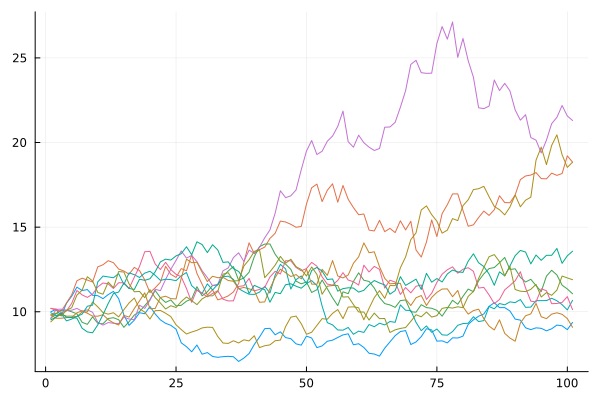

---
## Front matter
lang: ru-RU
title: Доклад
subtitle: Модели случайного блуждания
author:
  - Демидова Е. А.
institute:
  - Научный руководитель -- Кулябов Д. С.
  - Российский университет дружбы народов, Москва, Россия
date: 21 марта 2024

## i18n babel
babel-lang: russian
babel-otherlangs: english

## Formatting pdf
toc: false
toc-title: Содержание
slide_level: 2
aspectratio: 169
section-titles: true
theme: metropolis
header-includes:
 - \metroset{progressbar=frametitle,sectionpage=progressbar,numbering=fraction}
 - '\makeatletter'
 - '\beamer@ignorenonframefalse'
 - '\makeatother'
---

# Информация

## Докладчик

:::::::::::::: {.columns align=center}
::: {.column width="70%"}

  * Демидова Екатерина Алексеевна
  * студентка группы НКНбд-01-21
  * Российский университет дружбы народов
  * <https://github.com/eademidova>

:::
::: {.column width="30%"}


:::
::::::::::::::

# Введение

## Цели и задачи

**Цель работы**

Исследовать модели случайного блуждания.

**Задачи**

- Дать теоретическое описание моделей случайного блуждания
- Привести примеры реализации моделирования случайного блуждания

## Актуальность

Примеры применения математических моделей случайного блуждания: 

- моделирование движения цен на фондовом рынке 
- исследование диффузии в жидкостях 
- моделирование случайных процессов в биологии

## Инструменты

- Язык программирования `Julia`
  - `Random.jl` 
  - `StatsBase.jl` 
  - `Distributions.jl`
  - `Plots.jl`

# Одномерное дискретное случайное блуждание

## Определение

$$ 
S_n = \sum\limits_{i=1}^n \xi _i ,
$$ 

где $S_0 = 0$, $\{ \xi _n, n >= 1 \}$ -- случайные величины, $P( \xi _n = 1) = p$ и $P ( \xi _n = -1)  = 1 − p = q$

## Программная реализация

```julia
begin
	p_left = 0.5 # вероятность шага вниз
	p_right = 1 - p_left # вероятность шага вверх
	num_steps = 100 # количество шагов
	start_point = 0 # отправная точка
	end_point = 100 # ограничения
	count_steps = 1000
	plt = plot(legend = false)
  steps = [0]
	for i in 1:count_steps
		push!(step, step[i] + StatsBase.sample([-1, 1],
                ProbabilityWeights([p_left, p_right])))
	end
end
```

## Программная реализация

:::::::::::::: {.columns align=center}
::: {.column width="50%"}

{#fig:001 width=100%}

:::
::: {.column width="50%"}

{#fig:002 width=100%}

:::
::::::::::::::

# Винеровский процесс

## Определение

$$
dW = \epsilon \sqrt{dt},
$$

где $\epsilon$ — случайная величина со стандартным нормальным распределением $\epsilon ∼N(0,1)$; $t$ — дискретное время.

## Определение

Случайный процесс $W_t$, где $t ≥ 0$ называется винеровским процессом, если

- $W_0 = 0$ -- почти достоверно.
- $W_t$ -- процесс с независимыми приращениями.
- $W_t - W_s∼N(0 , \sigma ^2 ( t − s )), \forall 0 \le s<t<\infty$

## Программная реализация

```julia
h = 0.1
T = 100

function wiener(h, T) 
	return cumsum([rand(Normal(0,h)) for i in 0:h:T])
end
```

## Программная реализация

{#fig:003 width=70%}

# Броуновское движение

## Определение

1) движение броуновской частицы вызывается крайне частыми ударами со стороны непрестанно движущихся молекул окружающей жидкости;

2) движение этих молекул столь нерегулярно, что их воздействие на взвешенные частицы можно описать только вероятностным образом в предположении очень частых, статистически независимых ударов.

## Программная реализация

:::::::::::::: {.columns align=center}
::: {.column width="50%"}

{#fig:004 width=100%}

:::
::: {.column width="50%"}

{#fig:005 width=100%}

:::
::::::::::::::

# Геометрическое броуновское движение

## Определение

$$dX_t= \mu X_tdt+ \sigma X_t dW_t,$$

где $W_t$ - винеровский процесс, а $\mu$ -- параметр сноса, $\sigma$ параметр волатильности.

Решение:

$$X_t=X_0 e^{(a−frac{x^2}{2})t + s W_t}$$

## Программная реализация

```julia
h = 0.1
T = 100
s = 0.4
a = 0.1
x_0 = 10

function GBM(h, T, a, s)
	return x_0.*exp.((a - s^2/2). [0:h:T;] .+ s.*wiener(h,T))
end
```

## Программная реализация

{#fig:006 width=70%}

# Выводы

Дано описание и выполнена программная реализация простейшей модели случайного блуждания, винеровского процесса и геометрического броуновского движения.

## Список литературы

1. Жуковский М.Е., Родионов И.В. Основы теории вероятностей: учебное пособие. М.: МФТИ, 2015. 82 с.
2. Степанов С.С. Стохастический мир [Электронный ресурс]. 2012. 376 с. URL: http://synset.com/pdf/ito.pdf.
3. Гардинер К.В. Стохастические методы в естественных науках. Москва: Мир, 1986. 528 с.
4. Osborne M.F.M. Brownian motion in the stock market. Operations Research, 1959. 305 с.