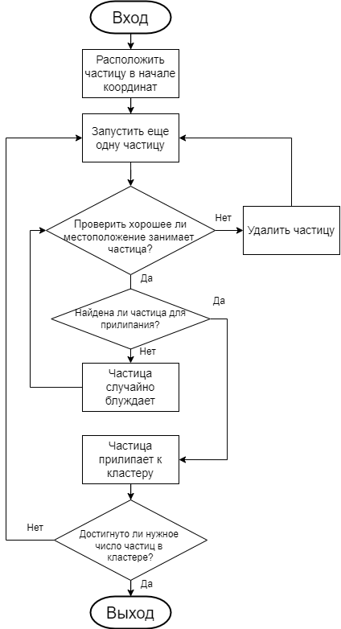
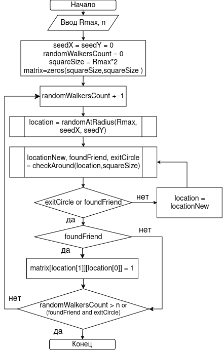
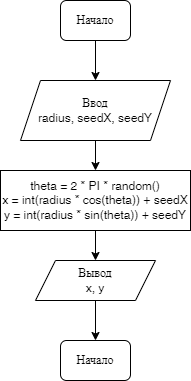
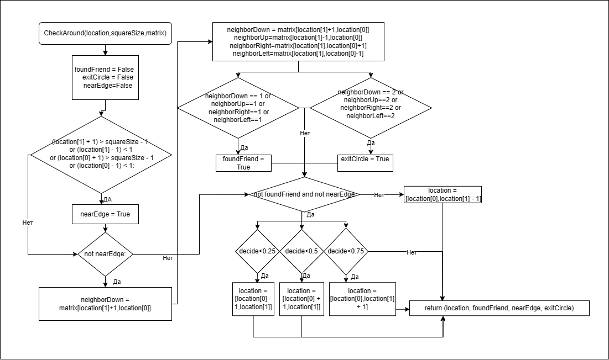

---
## Front matter
lang: ru-RU
title: Групповой проект "Неравновесная агрегация, фракталы
subtitle: Алгоритмы решения задачи
author:
  - Беличева Д. М.,
  - Демидова Е. А.,
  - Смирнов-Мальцев Е. Д.,
  - Сунгурова М. М.
institute:
  - Российский университет дружбы народов, Москва, Россия
date: 07 марта 2024

## i18n babel
babel-lang: russian
babel-otherlangs: english

## Formatting pdf
toc: false
toc-title: Содержание
slide_level: 2
aspectratio: 169
section-titles: true
theme: metropolis
header-includes:
 - \metroset{progressbar=frametitle,sectionpage=progressbar,numbering=fraction}
 - '\makeatletter'
 - '\beamer@ignorenonframefalse'
 - '\makeatother'
---

# Информация

## Состав исследовательской команды

Студенты группы НКНбд-01-21:

- Беличева Дарья Михайловна
- Демидова Екатерина Алексеевна
- Сунгурова Мариян Мухсиновна
- Смирнов-Мальцев Егор Дмитриевич

# Вводная часть

**Цель работы**

Рассмотреть алгоритм моделирования агрегации, ограниченной диффузией(DLA) на сетке.

**Задачи**

- Описать алгоритм моделирования DLA
- Описать алгоритм реализации DLA на сетке

## Описание алгоритма 

{#fig:001 width=27%}

## Описание алгоритма 

{#fig:001 width=31%}

## Описание алгоритма выпускания частицы

{#fig:001 width=25%}

## Случайное блуждане

Обозначим $v^u = (0,1)$ , $v^d = (0,-1)$, $v^r = (1,0)$, $v^l = (-1,0)$ - шаг на 1 вверх, вниз, влево, вправо соответственно.

$\{S_n\}$ -- ряд, описывающий случайное блуждание, $* = u, d, r, l$, $n$ -- количество шагов

$$
S_n = \sum^n_{i=1}{v_n^*}, 
$$

$$
P(v_{i+1} = v_n^*) = \dfrac{1}{4}
$$

## Описание алгоритма движения частицы

{#fig:001 width=83%}

# Заключение

## Вывод

Описан алгоритм DLA и алгоритм реализации этой модели с помощью блок-схем. 
