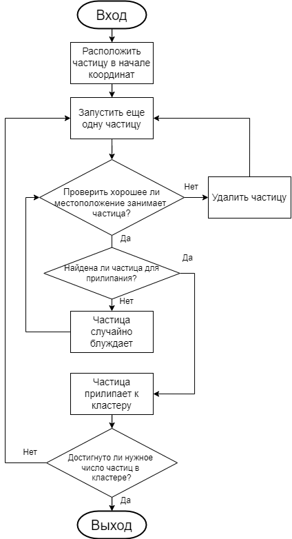
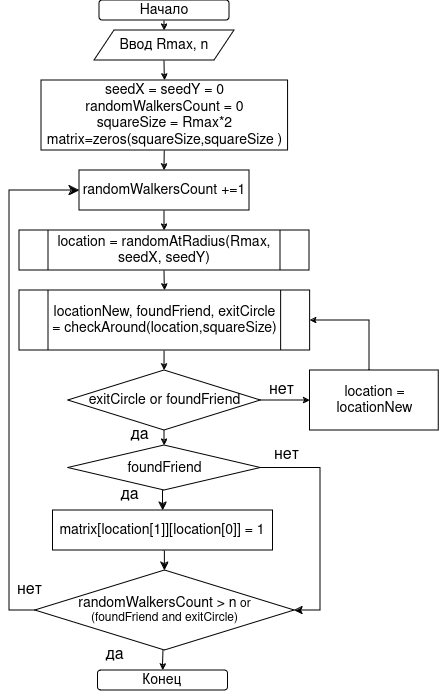
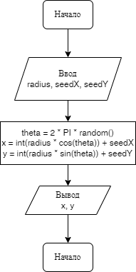
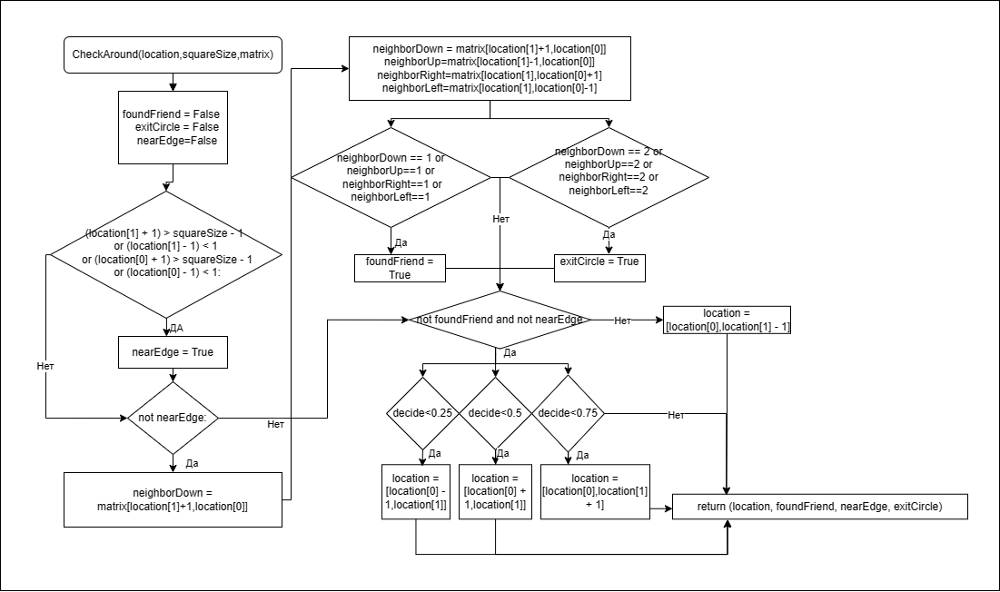

---
## Front matter
title: "Этап 2"
subtitle: "Алгоритм решения задачи"
author: 

  - Беличева Д. М.,
  - Демидова Е. А.,
  - Смирнов-Мальцев Е. Д.,
  - Сунгурова М. М.

## Generic otions
lang: ru-RU
toc-title: "Содержание"

## Bibliography
bibliography: bib/cite.bib
csl: pandoc/csl/gost-r-7-0-5-2008-numeric.csl

## Pdf output format
toc: true # Table of contents
toc-depth: 2
lof: true # List of figures
lot: false # List of tables
fontsize: 12pt
linestretch: 1.5
papersize: a4
documentclass: scrreprt
## I18n polyglossia
polyglossia-lang:
  name: russian
  options:
	- spelling=modern
	- babelshorthands=true
polyglossia-otherlangs:
  name: english
## I18n babel
babel-lang: russian
babel-otherlangs: english
## Fonts
mainfont: PT Serif
romanfont: PT Serif
sansfont: PT Sans
monofont: PT Mono
mainfontoptions: Ligatures=TeX
romanfontoptions: Ligatures=TeX
sansfontoptions: Ligatures=TeX,Scale=MatchLowercase
monofontoptions: Scale=MatchLowercase,Scale=0.9
## Biblatex
biblatex: true
biblio-style: "gost-numeric"
biblatexoptions:
  - parentracker=true
  - backend=biber
  - hyperref=auto
  - language=auto
  - autolang=other*
  - citestyle=gost-numeric
## Pandoc-crossref LaTeX customization
figureTitle: "Рис."
tableTitle: "Таблица"
listingTitle: "Листинг"
lofTitle: "Список иллюстраций"
lotTitle: "Список таблиц"
lolTitle: "Листинги"
## Misc options
indent: true
header-includes:
  - \usepackage{indentfirst}
  - \usepackage{float} # keep figures where there are in the text
  - \floatplacement{figure}{H} # keep figures where there are in the text
---

# Введение

**Цель работы**

Рассмотреть алгоритм моделирования агрегации, ограниченной диффузией(DLA) на сетке.

**Задачи**

- Описать алгоритм моделирования DLA
- Описать алгоритм реализации DLA на сетке

# Задание

Здесь приводится описание задания в соответствии с рекомендациями
методического пособия и выданным вариантом.

# Выполнение работы

## Описание алгоритма 

Рассматрим сеточную модель агрегации, ограниченной диффузией (Diffusion
Limited Aggregation, DLA [@sander:2000]). 

Возьмем регулярную квадратную сетку на плоскости.
В центр поместим затравочную частицу. Затем с расстояния чуть больше желаемого максимального радиуса итогового агрегата будем выпускать по одной новые частицы. Выпущенная частица совершает случайные блуждания по сетке, делая шаги в одном из четырех доступных направлений с равной вероятностью. Если частица оказывается по соседству с затравкой, она прилипает и остается в этом узле. Затем выпускаем следующую частицу, которая может прилипнуть к одному из занятых узлов. Шаг решетки в этой модели соответствует диаметру частицы(мы рассматриваем единичный шаг)(рис. @fig:001).

{#fig:001 width=100%}

## Описание алгоритма 

При реализации будем хранить информацию о частицах в массиве, если частица есть -- соответсвующий элемент матрицы равен один, если нет -- ноль. Помещаем частицу в центр поля. Новые частицы будем считать, чтобы можно было остановить программу при их желаемом количестве. Для запуска частицы используем функцию randomAtRadius, а для проверки положения частицы и её случайного блуждания checkAround. Новая частица запускается, когда текущая оказывается рядом с уже занятой клеткой. Программа прекращает работу либо если уже было запущено достаточное количество частиц, либо если агрегат достиг максимального радиуса(рис. @fig:002).

{#fig:002 width=100%}

## Описание алгоритма выпускания частицы

Для ускорения работы программы разумно выпускать частицы с круга радиусом немного больше Rmax текущего максимального радиуса агрегата. Функция генерирует случайное расположение точки на заданном радиусе по формуле[@medved:2010]:
$$
x = r * cos(\theta)
y = r * sin(\theta),
$$

где $\theta$ -- случайный угол от $0$ до $2 \pi$, заданный формулой: $2\pi random$(рис. @fig:003).

{#fig:003 width=70%}

## Случайное блуждане

Рассмотрим целочисленную решётку $Z^2$ на плоскости с отмеченной точкой $(0, 0) ∈ Z^2$ – началом координат. Каждой точке решётки  соответствуют четыре точки, в которые можно из неё шагнуть по выходящим из неё  ребрам: мы будем обозначать эти точки  $v^u = (0,1)$ , $v^d = (0,-1)$, $v^r = (1,0)$, $v^l = (-1,0)$ для шагов направо, налево, вверх и вниз соответственно. 
Случайное блуждание – это недетерминированное передвижение по решетке Z^2: стартуя из нуля, мы делаем один шаг в секунду, переходя в одну из соседних вершин к той вершине, в которой мы находились в предыдуший момент. При этом решение, в какую вершину шагнуть, принимается случайным образом.

Обозначим $v^u = (0,1)$ , $v^d = (0,-1)$, $v^r = (1,0)$, $v^l = (-1,0)$ - шаг на 1 вверх, вниз, влево, вправо соответственно.

$\{S_n\}$ - ряд, описывающий случайное блуждание, $* = u, d, r, l$, $n$ - количество шагов

$$
S_n = \sum^n_{i=1}{v_n^*}, 
$$

$$
P(v_{i+1} = v_n^*) = \dfrac{1}{4}
$$

## Описание алгоритма движения частицы

Эта функция проверяет местоположение частицы, чтобы убедиться, что она не находится на краю квадрата. 
Если не на краю, то проверяется периметр (вверх, вниз, влево, вправо). Булевым переменным foundFriend, exitCircle, nearEdge присваивается значение TRUE, если выполняются соответствующие условия:
Сначала проверяется, находится ли частица у края(nearEdge). Если частица не находится рядом с краем, проверяется, не находится ли она рядом с соседом(foundfriend ) или не достигла ли она требуемого радиуса(exitCircle).
После проверки местоположения, если оно хорошее, начинается случайное диффундирование — определяется новое местоположение. 
Функция возвращает новое местоположение(X,Y), foundFriend (BOOLEAN), nearEdge (BOOLEAN), exitCircle(BOOLEAN)(рис. @fig:004).

{#fig:004 width=100%}

# Выводы

В результате выполнение второго этапа проекта мы описали алгоритм DLA и алгоритм реализации этой модели с помощью блок-схем. 

# Список литературы{.unnumbered}

::: {#refs}
:::
