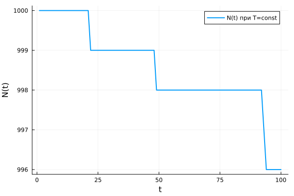
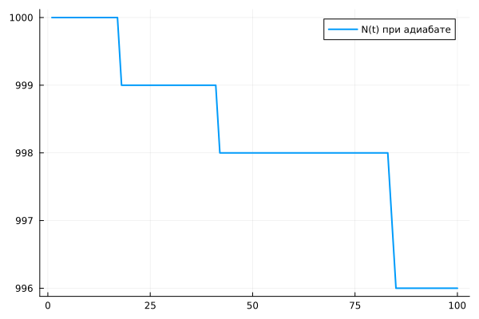
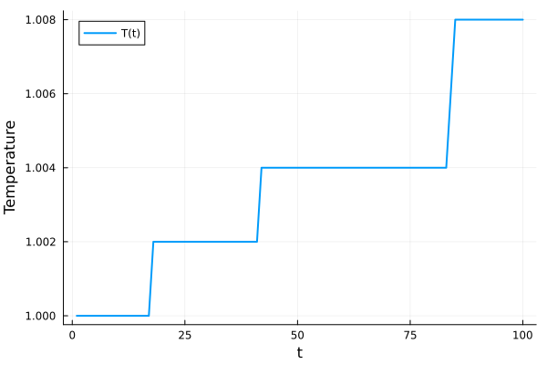
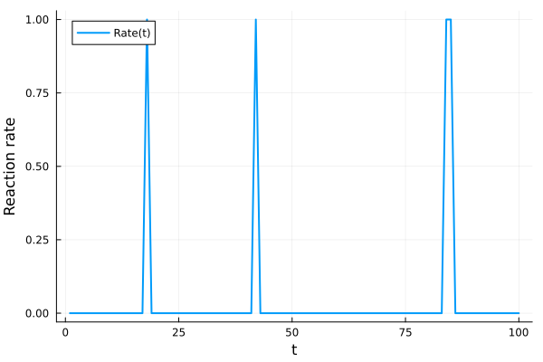

---
## Front matter
title: "Химические реакции, стохастическое горение"
subtitle: "Этап 3. Комплексы программ"
author: "Озьяс Стев Икнэль Дани"

## Generic otions
lang: ru-RU

## Formatting
toc: false
slide_level: 2
theme: metropolis
header-includes:
- \metroset{progressbar=frametitle,sectionpage=progressbar,numbering=fraction}
- '\makeatletter'
- '\beamer@ignorenonframefalse'
- '\makeatother'
aspectratio: 43
section-titles: true
---

# Информация

## Докладчик

:::::::::::::: {.columns align=center}
::: {.column width="70%"}

  * Озьяс Стев Икнэль Дани
  * студент группы НКНбд-01-21
  * Российский университет дружбы народов
  * <https://github.com/Dacossti>

:::
::: {.column width="30%"}

:::
::::::::::::::

# Цели и задачи работы

## Цель лабораторной работы
 
Написать программный комплекс для реализации задачи.

## Задачи

1. Напишите программу, моделирующую ансамбль частиц, в которых возможна мономолекулярная экзотермическая реакция. Рассмотрите случай нулевой теплопроводности. Постройте графики зависимости числа непрореагировавших частиц от времени при разных температурах. Сравните полученные графики с теоретическими зависимостями.
2. Постройте графики зависимости числа непрореагировавших частиц, температуры и скорости реакции от времени в случае бесконечной теплопроводности внутри области моделирования, считая процесс адиабатическим.

# Процесс выполнения

## Решение 

Построили графики зависимости числа непрореагировавших частиц, температуры и скорости реакции от времени в случаях нулевой теплопроводности и бесконечной теплопроводности внутри области моделирования, считая процесс адиабатическим.

- **Случай нулевой теплопроводности**

Построили график зависимости числа непрореагировавших частиц от времени:

{ #fig:001 width=70% height=70% }

## Решение 

- **Случай бесконечной теплопроводности**

Построили график зависимости числа непрореагировавших частиц от времени:

{ #fig:002 width=70% height=70% }

## Решение 

Построили график зависимости температуры от времени:

{ #fig:003 width=70% height=70% }

## Решение 

Построили график зависимости скорости от времени:

{ #fig:004 width=70% height=70% }

# Выводы по проделанной работе

## Вывод

Во время выполнения третьего этапа проекта мы написали на языке Julia программу, моделирующую ансамбль частиц, в которых возможна мономолекулярная экзотермическая реакция. Рассмотрели различные ситуации:

1. Случай нулевой теплопроводности
2. Случай бесконечной теплопроводности
