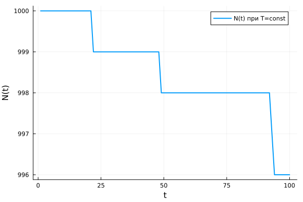
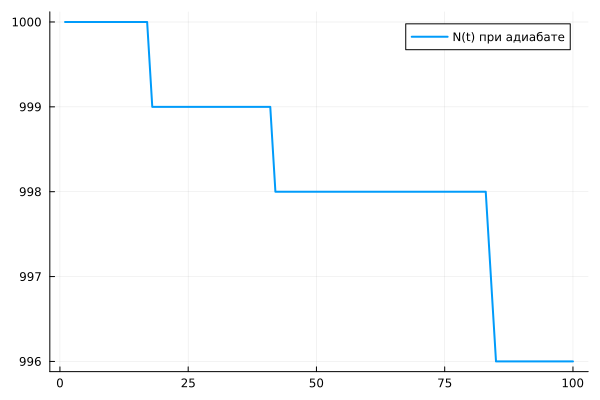
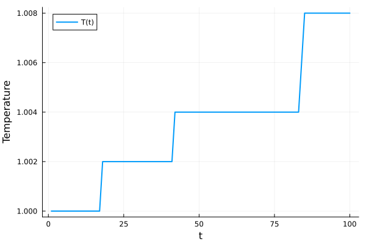
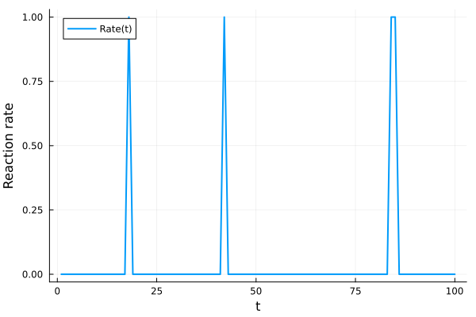

---
# Front matter
lang: ru-RU
title: "Химические реакции, стохастическое горение"
subtitle: "Этап 3.Комплексы программ"
author: "Озьяс Стев Икнэль Дани"

## Pdf output format
toc: true # Table of contents
toc-depth: 2
fontsize: 12pt
linestretch: 1.5
papersize: a4
documentclass: scrreprt
## I18n polyglossia
polyglossia-lang:
  name: russian
  options:
        - spelling=modern
        - babelshorthands=true
polyglossia-otherlangs:
  name: english
## I18n babel
babel-lang: russian
babel-otherlangs: english
## Fonts
mainfont: PT Serif
romanfont: PT Serif
sansfont: PT Sans
monofont: PT Mono
mainfontoptions: Ligatures=TeX
romanfontoptions: Ligatures=TeX
sansfontoptions: Ligatures=TeX,Scale=MatchLowercase
monofontoptions: Scale=MatchLowercase,Scale=0.9
## Biblatex
biblatex: true
biblio-style: "gost-numeric"
biblatexoptions:
  - parentracker=true
  - backend=biber
  - hyperref=auto
  - language=auto
  - autolang=other*
  - citestyle=gost-numeric
## Pandoc-crossref LaTeX customization
figureTitle: "Рис."
tableTitle: "Таблица"
listingTitle: "Листинг"
lofTitle: "Цель Работы"
lotTitle: "Ход Работы"
lolTitle: "Листинги"
## Misc options
indent: true
header-includes:
  - \usepackage{indentfirst}
  - \usepackage{float} # keep figures where there are in the text
  - \floatplacement{figure}{H} # keep figures where there are in the text
---

# Цель работы

Написать программный комплекс для реализации задачи.

# Задачи

1. Напишите программу, моделирующую ансамбль частиц, в которых возможна мономолекулярная экзотермическая реакция. Рассмотрите случай нулевой теплопроводности. Постройте графики зависимости числа непрореагировавших частиц от времени при разных
температурах. Сравните полученные графики с теоретическими зависимостями.
2. Постройте графики зависимости числа непрореагировавших частиц, температуры и скорости реакции от времени в случае бесконечной теплопроводности внутри области моделирования, считая процесс адиабатическим.

# Решение 

Построили графики зависимости числа непрореагировавших частиц, температуры и скорости реакции от времени в случаях нулевой теплопроводности и бесконечной теплопроводности внутри области моделирования, считая процесс адиабатическим.

- Случай нулевой теплопроводности

{ #fig:001 width=70% height=70% }

- Случай бесконечной теплопроводности

{ #fig:002 width=70% height=70% }

{ #fig:003 width=70% height=70% }

{ #fig:004 width=70% height=70% }


# Код программы на языке Julia

```julia

using Random
using Plots

# Функция моделирует мономолекулярную экзотермическую реакцию в ансамбле частиц
# thermal = "zero" — температура постоянна
# thermal = "infinite" — система с бесконечной теплопроводностью (адиабатический случай)

function simulate_reaction(N₀, Ea, q, c, τ, T₀, dt, steps; thermal="zero")
    N, T = N₀, T₀                     # Начальное количество частиц и температура
    Ns, Ts, vs = Float64[], Float64[], Float64[]  # Массивы для хранения N(t), T(t), скорости реакции

    for _ in 1:steps                  # Цикл по временным шагам
        reacted = 0                  # Счетчик среагировавших частиц на текущем шаге

        for _ in 1:N                 # Для каждой из оставшихся частиц
            E = -T * log(rand())     # Генерация энергии по экспоненциальному распределению
            if E > Ea                # Если энергия больше порога активации — реакция происходит
                reacted += 1
            end
        end

        rate = reacted / τ           # Скорость реакции = число реакций / характерное время
        N -= reacted                 # Обновляем количество непрореагировавших частиц
        push!(Ns, N)                 # Сохраняем значение N(t)
        push!(vs, rate)              # Сохраняем скорость реакции

        # Если система адиабатическая (тепло не уходит), температура растет
        if thermal == "infinite"
            T += (q * reacted) / (N₀ * c)  # Повышение температуры на шаге
        end
        push!(Ts, T)                 # Сохраняем значение температуры
    end

    return Ns, Ts, vs                # Возвращаем временные ряды для анализа
end


# Пример сценария
N₀ = 1000      # Начальное число частиц
Ea = 10.0      # Энергия активации
q = 2.0        # Количество тепла, выделяемое на реакцию
c = 1.0        # Удельная теплоемкость
τ = 1.0        # Характерное время реакции
T₀ = 1.0       # Начальная температура
dt = 1.0       # Шаг по времени (не используется напрямую)
steps = 100    # Общее число шагов моделирования

# Первый случай — постоянная температура
Ns1, _, _ = simulate_reaction(N₀, Ea, q, c, τ, T₀, dt, steps, thermal="zero")

# Второй случай — температура изменяется (адиабатическая система)
Ns2, Ts2, vs2 = simulate_reaction(N₀, Ea, q, c, τ, T₀, dt, steps, thermal="infinite")


# Построение графиков
display(plot(1:steps, Ns1, label="N(t) при T=const", xlabel="t", ylabel="N(t)", lw=2))
savefig("image1.png")

display(plot(1:steps, Ns2, label="N(t) при адиабате", lw=2))
savefig("image2.png")

display(plot(1:steps, Ts2, label="T(t)", xlabel="t", ylabel="Temperature", lw=2))
savefig("image3.png")

display(plot(1:steps, vs2, label="Rate(t)", xlabel="t", ylabel="Reaction rate", lw=2))
savefig("image4.png")
```


# Выводы

Во время выполнения третьего этапа проекта мы написали на языке Julia программу, моделирующую ансамбль частиц, в которых возможна мономолекулярная экзотермическая реакция. Рассмотрели различные ситуации:

1. Случай нулевой теплопроводности
2. Случай бесконечной теплопроводности


# Список литературы

1. Медведев Д.А. и др. Моделирование физических процессов и явлений на ПК: Учеб. пособие. Новосибирск: Новосиб. гос. ун-т, 2010. 101 с.
2. Gillespie D.T. Exact stochastic simulation of coupled chemical reactions. Journal of Physical Chemistry. — 1977. — Vol. 81, No. 25. — P. 2340–2361.
3. Yu C., Cai L., Chen J.-Y. Stochastic Modeling of Partially Stirred Reactor (PaSR) for the Investigation of the Turbulence-Chemistry Interaction for the Ammonia-Air Combustion. Flow, Turbulence and Combustion. — 2023. — Vol. 111. — P. 575–597.
