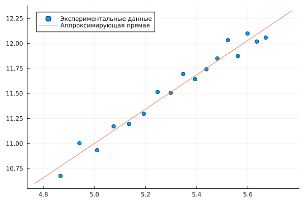

---
## Front matter
lang: ru-RU
title: Групповой проект "Неравновесная агрегация, фракталы"
subtitle: Результаты проекта
author:
  - Беличева Д. М.,
  - Демидова Е. А.,
  - Смирнов-Мальцев Е. Д.,
  - Сунгурова М. М.
institute:
  - Российский университет дружбы народов, Москва, Россия
date: 28 марта 2024

## i18n babel
babel-lang: russian
babel-otherlangs: english

## Formatting pdf
toc: false
toc-title: Содержание
slide_level: 2
aspectratio: 169
section-titles: true
theme: metropolis
header-includes:
 - \metroset{progressbar=frametitle,sectionpage=progressbar,numbering=fraction}
 - '\makeatletter'
 - '\beamer@ignorenonframefalse'
 - '\makeatother'
---

# Информация

## Состав исследовательской команды

Студенты группы НКНбд-01-21:

- Беличева Дарья Михайловна
- Демидова Екатерина Алексеевна
- Сунгурова Мариян Мухсиновна
- Смирнов-Мальцев Егор Дмитриевич

# Вводная часть

## Актуальность

Существуют разнообразные физические процессы, основная черта которых --- неравновесная агрегация:

- образование частиц сажи
- выращивание кристаллов соли
- распространение воды в нефти

## Цель и задачи

**Цель работы**

Исследовать модель агрегации, ограниченной диффузией(DLA).

**Задачи**

- Построить модель агрегации, ограниченной диффузией
- Найти размерность, получившихся кластеров
- Построить график зависимости числа частиц в кластере от радиуса гирации

## Объект и предмет исследования

- Модель DLA
- Фрактальная размерность
- График зависимости числа частиц в кластере от радиуса гирации

## Материалы и методы

- Язык программирования Julia
  - Plots.jl
  - Random.jl
  - ColorSchemes.jl

# Теоретическое описание задачи

## Фрактальная размерность

$$
d = \lim_{\epsilon \rightarrow 0}(\dfrac{ln(N(\epsilon))}{ln(\dfrac{1}{\epsilon})})
$$

$$
ln(N(\epsilon)) = D ln(R) + b,
$$

где $D$ – фрактальная размерность, $N(\epsilon)$ – число частиц на расстоянии меньшем чем $R$, $R$ – радиус.

## Агрегация, ограниченная диффузией

**Агрегация, ограниченная диффузией (diffusion-limited aggregation, DLA)** --- первая модель агрегации, представляющая собой шумный рост, ограниченный диффузией.

# Практическая реализация

## Описание алгоритма 

{#fig:001 width=27%}

## Случайное блуждане

Обозначим $v^u = (0,1)$ , $v^d = (0,-1)$, $v^r = (1,0)$, $v^l = (-1,0)$ - шаг на 1 вверх, вниз, влево, вправо соответственно.

$\{S_n\}$ -- ряд, описывающий случайное блуждание, $* = u, d, r, l$, $n$ -- количество шагов

$$
S_n = \sum^n_{i=1}{v_n^*}, 
$$

$$
P(v_{i+1} = v_n^*) = \dfrac{1}{4}
$$

# Результаты

## DLA кластер

:::::::::::::: {.columns align=center}
::: {.column width="50%"}

{#fig:002 width=100%}

:::
::: {.column width="50%"}

{#fig:003 width=100%}

:::
::::::::::::::

## Фрактальная размерность

При построении 17 моделей с ограничением по радиусу от 130 до 290 получили $D = 1.717$.

{#fig:004 width=60%}

# Заключение

## Выводы

- Построена модель агрегации, ограниченной диффузией
- Найдена фрактальная размерность, получившихся кластеров
- Построен график зависимости числа частиц в кластере от радиуса гирации

## Список литературы

1. Медведев Д.А. и др. Моделирование физических процессов и явлений на ПК: Учеб. пособие. Новосибирск: Новосиб. гос. ун-т, 2010. 101 с.
2. Sander L.M. Diffusion-limited aggregation: A kinetic critical phenomenon? Contemporary Physics, 2000.
