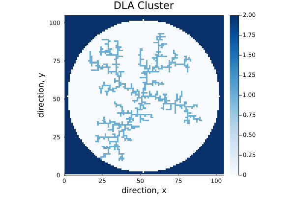
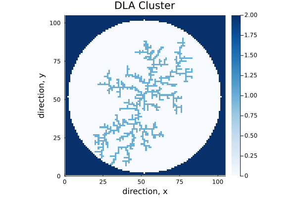
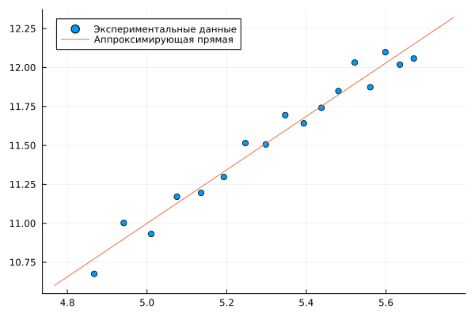

---
## Front matter
title: "Этап 4"
subtitle: "Результаты проекта"
author: 

  - Беличева Д. М.,
  - Демидова Е. А.,
  - Смирнов-Мальцев Е. Д.,
  - Сунгурова М. М.

## Generic otions
lang: ru-RU
toc-title: "Содержание"

## Bibliography
bibliography: bib/cite.bib
csl: pandoc/csl/gost-r-7-0-5-2008-numeric.csl

## Pdf output format
toc: true # Table of contents
toc-depth: 2
lof: true # List of figures
lot: false # List of tables
fontsize: 12pt
linestretch: 1.5
papersize: a4
documentclass: scrreprt
## I18n polyglossia
polyglossia-lang:
  name: russian
  options:
	- spelling=modern
	- babelshorthands=true
polyglossia-otherlangs:
  name: english
## I18n babel
babel-lang: russian
babel-otherlangs: english
## Fonts
mainfont: PT Serif
romanfont: PT Serif
sansfont: PT Sans
monofont: PT Mono
mainfontoptions: Ligatures=TeX
romanfontoptions: Ligatures=TeX
sansfontoptions: Ligatures=TeX,Scale=MatchLowercase
monofontoptions: Scale=MatchLowercase,Scale=0.9
## Biblatex
biblatex: true
biblio-style: "gost-numeric"
biblatexoptions:
  - parentracker=true
  - backend=biber
  - hyperref=auto
  - language=auto
  - autolang=other*
  - citestyle=gost-numeric
## Pandoc-crossref LaTeX customization
figureTitle: "Рис."
tableTitle: "Таблица"
listingTitle: "Листинг"
lofTitle: "Список иллюстраций"
lotTitle: "Список таблиц"
lolTitle: "Листинги"
## Misc options
indent: true
header-includes:
  - \usepackage{indentfirst}
  - \usepackage{float} # keep figures where there are in the text
  - \floatplacement{figure}{H} # keep figures where there are in the text
---

# Введение

**Актуальность**

Существуют разнообразные физические процессы, основная черта которых --- неравновесная агрегация. Примеры: образование частиц сажи, рост осадков при электрическом осаждении и распространение воды в нефти. Один из важных примеров фракталов появляется при добыче нефти. Нефтяники через одну из скважин заливают в месторождение нефти воду. Из других скважин начинает выходить нефть. Однако вода распространяется внутри месторождения неравномерно, образуя т.н. "фьорды". Нефть, находящаяся в этих фьордах не выходит наружу и остается не добытой. Поэтому вместо воды необходимо найти жидкость, для которой эти фьорды будут минимальны.

Во всех случаях происходит необратимое прилипание частиц к растущему кластеру из-за сильного смещения равновесия в сторону твердой фазы, и вырастают разветвленные агрегаты (рост правильных ограненных кристаллов происходит в условиях, близких к равновесным, когда возможно как прилипание частиц, так и их обратный переход в раствор)[@medved:2010].

**Цель работы**

Исследовать модель агрегации, ограниченной диффузией(DLA).

**Объект и предмет исследования**

- Модель DLA
- Фрактальная размерность
- График зависимости числа частиц в кластере от радиуса гирации

**Задачи**

- Построить модель агрегации, ограниченной диффузией
- Найти размерность, получившихся кластеров
- Построить график зависимости числа частиц в кластере от радиуса гирации

**Материалы и методы**

- Язык программирования Julia
  - Plots.jl
  - Random.jl
  - ColorSchemes.jl

# Теоретическое описание задачи

## Фрактальная размерность

$$
d = \lim_{\epsilon \rightarrow 0}(\dfrac{ln(N(\epsilon))}{ln(\dfrac{1}{\epsilon})})
$$

Это равенство является определением размерности, которая обозначается $d$. Для построения зависимости между оценкой радиуса и массы кластера (линейна) на логарифмической диаграмме, функция имеет вид:

$$
ln(N(\epsilon)) = D ln(R) + b,
$$

где $D$ – фрактальная размерность, $N(\epsilon)$ – число частиц на расстоянии меньшем чем $R$, $R$ – радиус 

## Агрегация, ограниченная диффузией

Агрегация, ограниченная диффузией (diffusion-limited aggregation, DLA) --- первая модель агрегации, разработанная Виттеном и Сандером в 1981 году. Она представляет шумный рост, ограниченный диффузией. Этот процесс довольно распространен в природе, и простой алгоритм дает хорошее представление о крупномасштабной структуре многих природных объектов[@sander:2000].

У получающегося кластера может быть много различных форм, преимущественно зависящих от трёх факторов:

- положение центра агрегации;
- начальное положение движущейся частицы;
- алгоритм моделирования движения.

По алгоритму движения частицы существует два подхода к базовому моделированию DLA. Один работает с фиксированной сеткой, а другой — без сетки и использует частицы. Сетки обеспечивают жесткую структуру, которая упрощает модель. В этом случае частица может двигаться по сетке только к одному из четырех соседей.

# Программная реализация

## Описание алгоритма 

Рассматрим сеточную модель агрегации, ограниченной диффузией (Diffusion
Limited Aggregation, DLA [@sander:2000]). 

Возьмем регулярную квадратную сетку на плоскости.
В центр поместим затравочную частицу. Затем с расстояния чуть больше желаемого максимального радиуса итогового агрегата будем выпускать по одной новые частицы. Выпущенная частица совершает случайные блуждания по сетке, делая шаги в одном из четырех доступных направлений с равной вероятностью. Если частица оказывается по соседству с затравкой, она прилипает и остается в этом узле. Затем выпускаем следующую частицу, которая может прилипнуть к одному из занятых узлов. Шаг решетки в этой модели соответствует диаметру частицы(мы рассматриваем единичный шаг)(рис. @fig:001).

{#fig:001 width=100%}

Для ускорения работы программы разумно выпускать частицы с круга радиусом немного больше Rmax текущего максимального радиуса агрегата. Функция генерирует случайное расположение точки на заданном радиусе по формуле[@medved:2010]:
$$
x = r * cos(\theta)
y = r * sin(\theta),
$$

где $\theta$ -- случайный угол от $0$ до $2 \pi$, заданный формулой: $2\pi random$

## Случайное блуждане

Рассмотрим целочисленную решётку $Z^2$ на плоскости с отмеченной точкой $(0, 0) ∈ Z^2$ – началом координат. Каждой точке решётки  соответствуют четыре точки, в которые можно из неё шагнуть по выходящим из неё  ребрам: мы будем обозначать эти точки  $v^u = (0,1)$ , $v^d = (0,-1)$, $v^r = (1,0)$, $v^l = (-1,0)$ для шагов направо, налево, вверх и вниз соответственно. 
Случайное блуждание – это недетерминированное передвижение по решетке Z^2: стартуя из нуля, мы делаем один шаг в секунду, переходя в одну из соседних вершин к той вершине, в которой мы находились в предыдуший момент. При этом решение, в какую вершину шагнуть, принимается случайным образом.

Обозначим $v^u = (0,1)$ , $v^d = (0,-1)$, $v^r = (1,0)$, $v^l = (-1,0)$ - шаг на 1 вверх, вниз, влево, вправо соответственно.

$\{S_n\}$ - ряд, описывающий случайное блуждание, $* = u, d, r, l$, $n$ - количество шагов

$$
S_n = \sum^n_{i=1}{v_n^*}, 
$$

$$
P(v_{i+1} = v_n^*) = \dfrac{1}{4}
$$

# Результаты

## DLA кластер

В результате получили следующие примеры DLA кластера(рис. @fig:002, @fig:003).

{#fig:002 width=100%}

{#fig:003 width=100%}

## Фрактальная размерность

Для подсчёта размерности фракталов, полученного с помощью DLA мы построили 17 моделей с ограничением по радиусу от 130 до 290. На рис. @fig:004 изображён график зависимости логарифма массы модели от логарифма радиуса. Полученные данные аппроксимируются прямой с угловым коэффициентом 1.717. Это число примерно равно размерности данного фрактала.

{#fig:004 width=100%}

Это соответствует утверждению, что DLA кластер -- фрактал, так как у фракталов дробная размерность. Как известно, у кластера DLA на плоскости размерность $D ≈ 1,71 \pm 0,02$, поэтому можно сделать вывод, что наша программа достаточно точно иммитирует агрегацию, ограниченную диффузией.

# Выводы

- Построена модель агрегации, ограниченной диффузией
- Найдена фрактальная размерность, получившихся кластеров
- Построен график зависимости числа частиц в кластере от радиуса гирации

# Список литературы{.unnumbered}

::: {#refs}
:::
